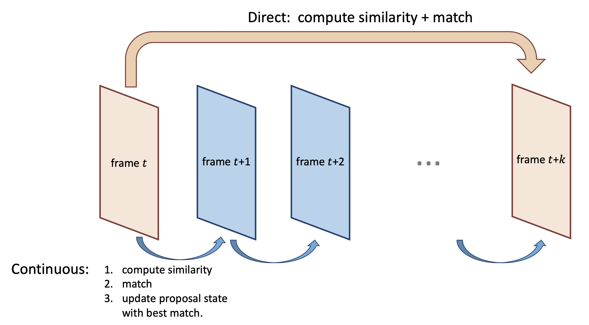

# Association Similarity

(Full code will release soon)

Here we compare the association ability of various similarity measures, as shown in 
"Table 2 Association Similarity Ablation " in the [paper](https://arxiv.org/abs/2104.11221).

Given a proposal in frame *t*, we evaluate if the chosen similarity measure can find the corresponding proposal in frame *t + k*.

For each similarity measure, it operates in two different modes: 

- The "Continuous" approach utilizes the intermediate frames between frame *t* and frame *t+k*.
- The "Direct" approach compute the similarity directly between frame *t* and frame *t + k*.




To run the experiments yourself, you can use the following example (not released yet)

```
python eval/eval_proposal_similarity.py \
  --image_dir <directory containing video frames> \
  --prop_dir <directory containing all proposals (for every frame)> \
  --gt_path <path to GT.json> \
  --opt_flow_dir <directory containing pre-computed optical flow vectors> \
  --outdir <output directory to store results> \
  --similarity_func opt-flow-bbox-continuous \
  --pair_gap 1sec --datasrc ArgoVerse
```
